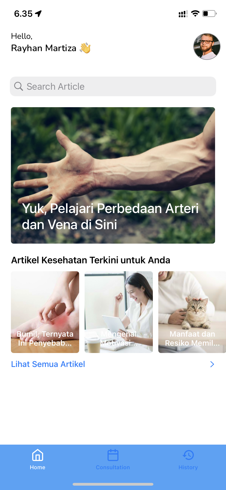

<div id="top"></div>

[![Contributors][contributors-shield]][contributors-url]

<br>
<div align="center">
  <a href="https://github.com/Rakamin-Bootcamp-Kelompok-1/alodokter-rakamin-ios-grup1">
    
  </a>
  <p align="center">
    <a href="https://github.com/Rakamin-Bootcamp-Kelompok-1/alodokter-rakamin-ios-grup1">
		  <h3 align="center">MediKuy</h1>
    </a>
  </p>
</div>

<details>
  <summary>Table of Contents</summary>
  <ol>
    <li>
      <a href="#about-the-project">About The Project</a>
      <ul>
        <li><a href="#built-with">Built With</a></li>
      </ul>
    </li>
    <li>
      <a href="#getting-started">Getting Started</a>
      <ul>
        <li><a href="#recommended-prerequisites">Recommended Prerequisites</a></li>
        <li><a href="#installation">Installation</a></li>
      </ul>
    </li>
    <li><a href="#screenshot">Screenshot</a></li>
    <li><a href="#creator">Creator</a></li>
  </ol>
</details>

## About The Project
<table align="center">
  <tr>
    <td align="center" colspan="3">Medikuy Screenshots</td>
  </tr>
  <tr>
    <td></td>
    <td></td>
    <td></td>
  </tr>
</table>
<p align="justify">
  MediKuy is an app developed for Alodokter x Rakamin Bootcamp Intern Final Project. Users are able to read artciles and book a doctor for themselves or someone else.
</p>
<p align="right">(<a href="#top">back to top</a>)</p>

### Built With

* [Foundation](https://developer.apple.com/documentation/foundation)
* [UIKit](https://developer.apple.com/documentation/uikit)
* [Alamofire](https://github.com/Alamofire/Alamofire)
* [SwiftyJSON](https://github.com/SwiftyJSON/SwiftyJSON)
* [SDWebImage](https://github.com/SDWebImage/SDWebImage)
* [IQKeyboardManager](https://github.com/hackiftekhar/IQKeyboardManager)
* MVVM Architecture Pattern
<p align="right">(<a href="#top">back to top</a>)</p>

## Getting Started

### Recommended Prerequisites

* Xcode version 13.0
* Swift version 5.0
* Minimum iOS 12.1

### Installation

1. Clone the repo
   ```sh
   git clone https://github.com/Rakamin-Bootcamp-Kelompok-1/alodokter-rakamin-ios-grup1.git
   ```
2. Build and run the project on Simulator or iPhone

<p align="right">(<a href="#top">back to top</a>)</p>

## Screenshot

<table align="center">
  <tr>
    <td align="center">Splash Screen</td>
    <td align="center">Sign Up Screen</td>
    <td align="center">Sign In Screen</td>
  </tr>
  <tr>
    <td align="center"></td>
    <td align="center"></td>
    <td align="center"></td>
  </tr>
  <tr>
    <td align="center">Home Screen</td>
    <td align="center">Article List Screen</td>
    <td align="center">Article Detail Screen</td>
  </tr>
  <tr>
    <td align="center"></td>
    <td align="center"></td>
    <td align="center"></td>
  </tr>
  <tr>
    <td align="center">Article Search Screen</td>
    <td align="center">Consultation Screen</td>
    <td align="center">Doctor Search Screen</td>
  </tr>
  <tr>
    <td align="center"></td>
    <td align="center"></td>
    <td align="center"></td>
  </tr>
  <tr>
    <td align="center">Doctor Detail Screen</td>
    <td align="center">Doctor Appointment Screen</td>
    <td align="center">Booking Success Screen</td>
  </tr>
  <tr>
    <td align="center"></td>
    <td align="center"></td>
    <td align="center"></td>
  </tr>
  <tr>
    <td align="center">History Screen</td>
    <td align="center">History Detail Screen</td>
    <td align="center">My Profile Screen</td>
  </tr>
  <tr>
    <td align="center"></td>
    <td align="center"></td>
    <td align="center"></td>
  </tr>  
  <tr>
    <td align="center" colspan="1.5">Edit Profile Screen</td>
    <td align="center" colspan="1.5">Change Password Screen</td>
  </tr>
  <tr>
    <td align="center" colspan="1.5"></td>
    <td align="center" colspan="1.5"></td>
  </tr>  
</table>

<p align="right">(<a href="#top">back to top</a>)</p>

## Creator
MediKuy iOS App was developed by:
* [Rayhan Martiza Faluda](https://github.com/rayhanfaluda)
* [Jeremy Endratno](https://github.com/jeremyendratno)
* [Ricky Austin](https://github.com/RickyAS)
* [Agung Saputra](https://github.com/agung3535)
* [Hafied Khalifatul](https://github.com/hafied17)

<p align="right">(<a href="#top">back to top</a>)</p>

<!-- MARKDOWN LINKS & IMAGES -->
[contributors-shield]: https://img.shields.io/github/contributors/Rakamin-Bootcamp-Kelompok-1/alodokter-rakamin-ios-grup1.svg?style=for-the-badge
[contributors-url]: https://github.com/Rakamin-Bootcamp-Kelompok-1/alodokter-rakamin-ios-grup1/graphs/contributors
